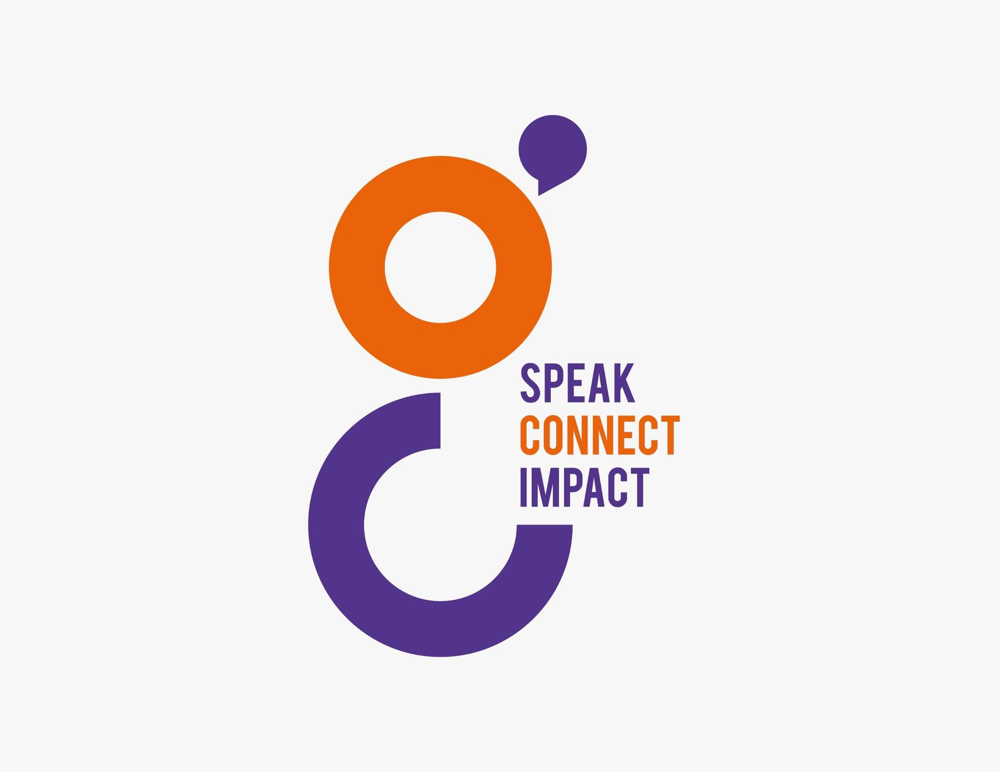

# Trygc CRM Hub

**Trygc CRM Hub** is the central workspace for managing customers, conversations, and pipeline, with dashboards, analytics, and day-to-day operations in one place.



## Features

- Built with Next.js 16, TypeScript, Tailwind CSS v4, and Shadcn UI
- Responsive and mobile-friendly
- Customizable theme presets (light/dark modes with color schemes like Tangerine, Brutalist, and more)
- Flexible layouts (collapsible sidebar, variable content widths)
- Authentication flows and screens
- Prebuilt dashboards (Default, CRM, Finance, Analytics, Productivity) plus legacy variants
- Role-Based Access Control (RBAC) with config-driven UI and multi-tenant support *(planned)*

> [!NOTE]
> The default dashboard uses the **shadcn neutral** theme.
> Additional color presets inspired by [Tweakcn](https://tweakcn.com) are included:
>
> - Tangerine
> - Neo Brutalism
> - Soft Pop
>
> You can create more presets by following the same structure as the existing ones.

## Brand assets

| File | Use |
| --- | --- |
| `public/logo-mark.svg` | Vector mark, transparent, brand colors. Backs the in-app `<BrandMark />` component. |
| `public/logo-mark.png` | Transparent raster mark. |
| `public/logo-full.png` | Transparent full lockup (mark + wordmark). |
| `public/icon-192.png`, `public/icon-512.png` | Transparent app icons. |
| `src/app/icon.svg`, `src/app/favicon.ico`, `src/app/apple-icon.png` | Browser and home-screen icons, wired up automatically by the Next.js App Router. |

Brand colors: orange `#EA620A`, purple `#52348C`.

Use `<BrandMark />` from `@/components/brand-logo` for the logo in the UI. Pass `mono` to render it in a single inherited color on tinted panels.

## Tech Stack

- **Framework**: Next.js 16 (App Router), TypeScript, Tailwind CSS v4
- **UI Components**: Shadcn UI
- **Validation**: Zod
- **Forms & State Management**: React Hook Form, Zustand
- **Tables & Data Handling**: TanStack Table
- **Tooling & DX**: Biome, Husky

## Screens

- Default Dashboard
- CRM Dashboard
- Finance Dashboard
- Analytics Dashboard
- Productivity Dashboard
- E-commerce Dashboard
- Academy Dashboard
- Logistics Dashboard
- Infrastructure Dashboard
- File Manager
- Patient Monitoring
- Chat Page
- Email Page
- Profile
- Users Management
- Roles Management
- Kanban Board
- Tasks Page
- Invoice Page
- Calendar Page
- Authentication (4 screens)
- Legacy: Default v1, CRM v1, Finance v1, Analytics v1

## Colocation File System Architecture

This project follows a **colocation-based architecture** — each feature keeps its own pages, components, and logic inside its route folder.
Shared UI, hooks, and configuration live at the top level, making the codebase modular, scalable, and easier to maintain as the app grows.

## Getting Started

1. **Install dependencies**
   ```bash
   npm install
   ```

2. **Start the development server**
   ```bash
   npm run dev
   ```

Your app will be running at [http://localhost:3000](http://localhost:3000)

### Formatting and Linting

Format, lint, and organize imports:

```bash
npx @biomejs/biome check --write
```

> For more information on available rules, fixes, and CLI options, refer to the [Biome documentation](https://biomejs.dev/).

---

Built on the open-source [next-shadcn-admin-dashboard](https://github.com/arhamkhnz/next-shadcn-admin-dashboard) template by Arham Khan (MIT).
